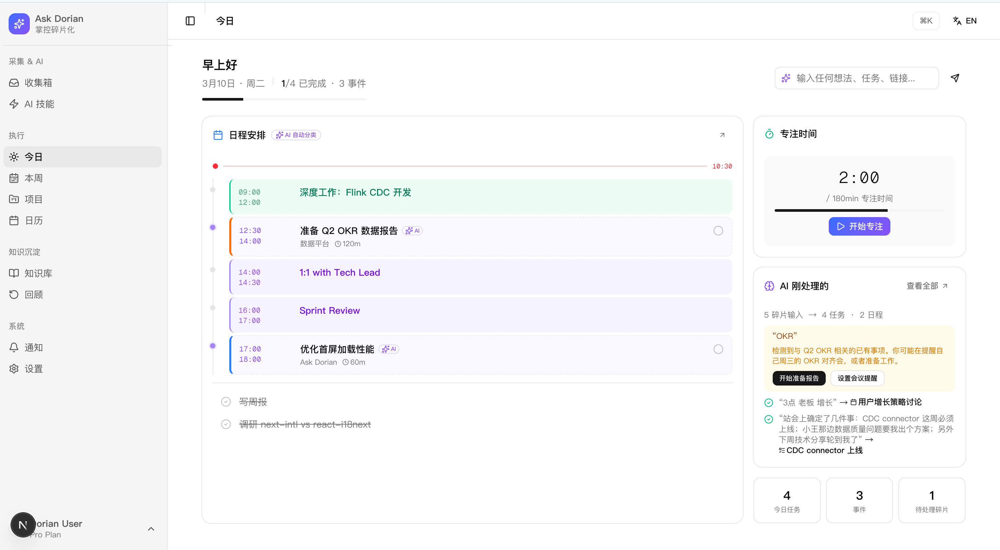
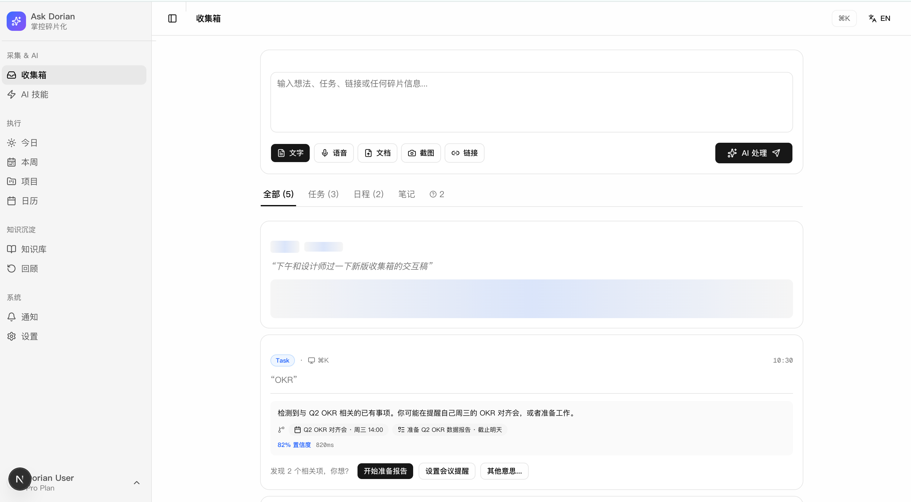
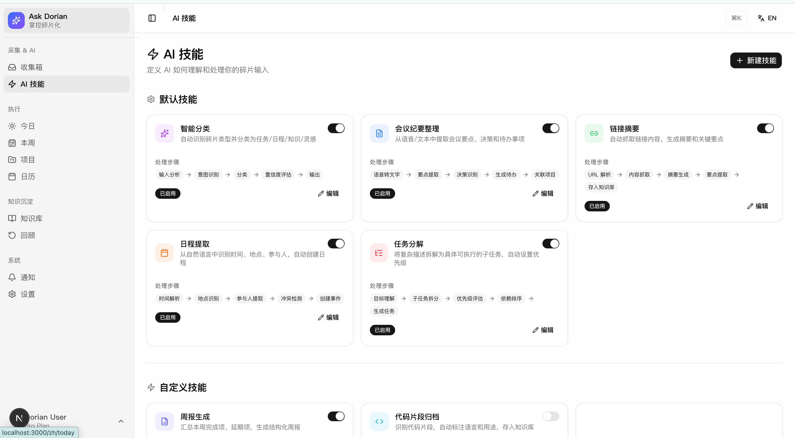
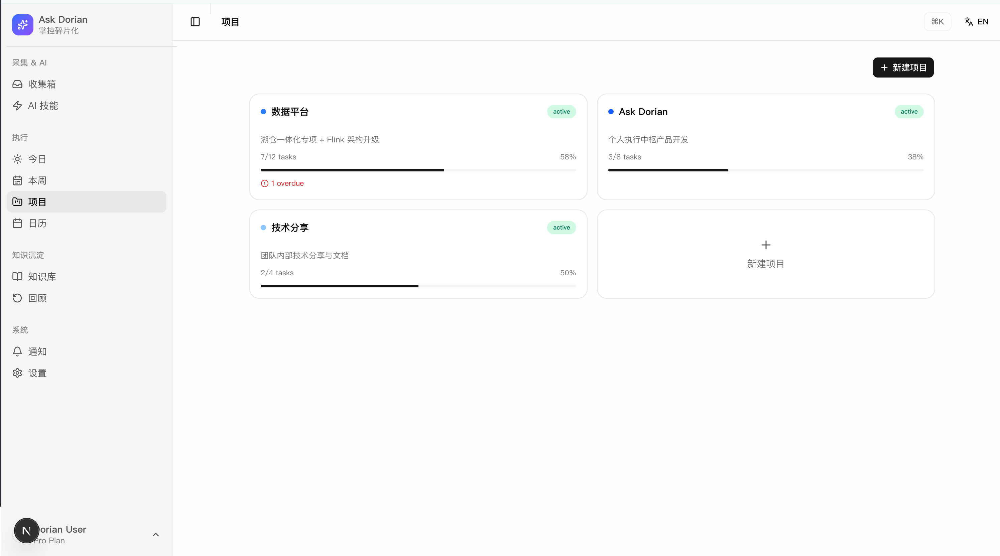

<p align="center">
  <h1 align="center">Ask Dorian</h1>
  <p align="center"><strong>碎片输入驱动的个人执行中枢</strong></p>
  <p align="center"><strong>Fragment-driven personal execution hub</strong></p>
</p>

---

<details open>
<summary><b>中文</b></summary>

## 这是什么

Ask Dorian 是一个面向个人用户的智能工作助手。核心链路：

```
碎片输入 → AI 结构化理解 → 日历/任务联动 → Today 执行 → Review 沉淀
```

你丢入任何东西 — 文字、语音、截图、链接、两个字的备忘 — Dorian 理解你的意图，自动创建任务、日程、知识条目，并关联到已有项目。你不需要手动整理，只管执行。

## 核心能力

### 五层 AI 处理管道

1. **理解** — 语义分析 + 意图识别，不是关键词匹配
2. **关联** — 自动连接到已有项目、任务、日程
3. **冲突检测** — 日历冲突、优先级矛盾、遗忘提醒
4. **主动规划** — 建议时间段、拆分复杂任务、创建前置依赖
5. **跟进闭环** — 到期提醒、逾期预警、行为模式学习

### 多端碎片捕获

- **桌面端** — Tauri 常驻菜单栏，全局快捷键 `Cmd+K` 随时捕获
- **移动端** — React Native (iOS)，Share Extension / 语音输入 / 通知推送
- **Web** — Next.js 仪表盘，完整工作台体验
- **更多渠道** — 截图 OCR、剪贴板监听、邮件转发

所有渠道汇入统一的 Fragment API → AI Pipeline → Stream。

## 问题

你收到一条消息 —— "下周三对齐 OKR"。你想着等会儿加到日历里。然后忘了。

你收藏了一篇好文章。再也没打开过。

开会时突然有个好想法。散会后就忘了。

**你的碎片散落在 5 个以上的 app 里，大部分悄悄无声息地消失了。**

每个工具都在等 *你* 来干活 — Notion 要你整理，Todoist 要你手动输入，日历要你自己排。但你真正需要的，只是把想法 **记下来** 然后继续。

## 不是又一个 AI 聊天工具

市面上已经有太多 AI 助手了。ChatGPT、Claw、Copilot — 它们擅长回答问题，但回答完之后什么也不做。你还是得手动把答案复制到任务列表、日历或笔记里。

**Ask Dorian 完全不同。**

它不是聊天机器人。它不是笔记工具。它是碎片输入和有序生活之间，**缺失的那层自动化处理管道**。

> 你丢入任何东西 → Dorian 理解、关联、规划、执行 → 你只管做

## 它怎么工作

### 上下文感知 AI，不是简单分类

大部分工具只做表面分类："这看起来像任务 → 创建任务"。到此为止。

Dorian 会读取你的 **完整上下文** — 项目、任务、日程、最近碎片、行为模式 — 来深度理解你到底想说什么，即使输入再碎片化。

**示例 1: 你输入 "OKR"**

> Dorian 发现你周三有一个 OKR 对齐会，还有一个未完成的"准备 OKR 报告"任务。它不会创建新东西，而是说："发现 2 个相关项 → *[开始准备报告] [提醒我会议]*"

**示例 2: 你输入 "3点 老板 增长"**

> Dorian 推断：今天下午3点，老板召集的用户增长讨论会。但检测到冲突 — 3:00-4:00 已有专注时间。"*已创建会议 + 冲突提醒 → [把专注时间移到4点] [保留两个]*"

**示例 3: 站会笔记 — "站会上确定了：CDC本周上线；小王数据质量问题我出方案；下周技术分享轮到我"**

> Dorian 拆分为 3 个独立事项：
> - "CDC 上线" → 关联到已有的 Code Review 任务，更新截止日
> - "数据质量方案" → 新建高优先级任务，建议安排到明天空闲时段
> - "技术分享准备" → 新建任务，基于最近知识沉淀建议分享主题

**示例 4: "下周二妈妈生日"**

> Dorian 理解"生日"的完整含义 — 这不只是日历事件。"*已创建日程 + 提前一天提醒 → [需要准备礼物吗？]*"

**示例 5: 你转发一篇文章链接**

> Dorian 自动抓取正文，生成摘要，打上标签，存入知识库。如果内容跟你正在做的项目相关，自动关联。

### 功能模块

| 模块 | 说明 |
|------|------|
| **Today（今日）** | 每日指挥中心 — 任务、日程、rituals、专注时间、待处理碎片 |
| **Stream（碎片流）** | 统一碎片入口 + AI 自动分类展示 |
| **Library（知识库）** | 知识沉淀、语义搜索、标签、关联 |
| **Review（回顾）** | 周统计、成就、AI 洞见、下周重点 |
| **Settings（设置）** | 个人资料、AI 偏好、系统设置 |
| **Help Center（帮助中心）** | 帮助分类、反馈、系统状态 |

## 技术架构

```
ask-dorian/                   # pnpm monorepo
├── packages/
│   ├── web/                  # Next.js 16 + React 19 + Tailwind 4 + shadcn/ui
│   ├── server/               # Koa.js + Drizzle ORM (独立进程，非 API Routes)
│   ├── mobile/               # React Native + Vite (web 预览)
│   ├── desktop/              # Tauri menubar app
│   ├── core/                 # 共享逻辑 — API client, hooks, stores, types
│   └── showcase/             # UI 原型展示图
└── docs/                     # 架构文档、数据库 Schema、PRD
```

| 层 | 技术选型 |
|----|----------|
| **Frontend** | Next.js 16, React 19, Tailwind CSS 4, shadcn/ui (base-nova), Recharts, Lucide, Zustand |
| **Mobile** | React Native, React Navigation, Vite (web 模式) |
| **Desktop** | Tauri — 常驻菜单栏，全局快捷键 |
| **Backend** | Node.js (Koa.js), Drizzle ORM, Zod validation |
| **Database** | PostgreSQL 16 + pgvector 0.8.1 (16 表，FK + 多态关联) |
| **AI** | Claude Sonnet (理解/生成), Claude Haiku (分类), OpenAI text-embedding-3-small (1536d), Whisper (语音) |
| **Auth** | JWT HS256 双 Token (15min access + 7d refresh rotation), Google OAuth, 设备绑定 |
| **部署** | AWS EC2 (Singapore) + RDS PostgreSQL, Cloudflare CDN + SSL, Nginx, PM2 |

## 产品展示

### Today


### Stream


### AI 技能


### 项目


## 开发

### 快速开始

```bash
pnpm install               # 安装依赖
pnpm dev:server            # 启动后端 (localhost:4000)
pnpm dev:web               # 启动 Web 前端
pnpm dev:mobile-web        # 启动 Mobile Web (Vite)
```

### 测试账号

| 字段 | 值 |
|------|------|
| Email | `dorian@askdorian.com` |
| Password | `dorian2024` |

预置了 rituals、tasks、events、fragments、knowledge 等示例数据，可直接体验完整功能。

```bash
bash scripts/seed-dorian.sh                            # 本地 (localhost:4000)
bash scripts/seed-dorian.sh https://api.askdorian.com  # 生产环境
```

### 全部命令

```bash
pnpm dev:server            # 后端 API
pnpm dev:web               # Web 仪表盘
pnpm dev:mobile-web        # Mobile Web (Vite)
pnpm dev:desktop           # Tauri 桌面端
pnpm db:studio             # Drizzle Studio (数据库可视化)
pnpm db:migrate            # 数据库迁移
```

</details>

<details>
<summary><b>English</b></summary>

## What Is This

Ask Dorian is an AI-powered personal productivity hub. Core pipeline:

```
Fragment input → AI structured understanding → Calendar/Task linking → Daily execution → Weekly review
```

Throw in anything — text, voice, screenshots, links, two-word memos — Dorian understands your intent, auto-creates tasks, events, knowledge entries, and links them to existing projects. No manual organizing, just execute.

## Core Capabilities

### 5-Layer AI Processing Pipeline

1. **Understand** — Semantic analysis + intent recognition, not keyword matching
2. **Link** — Auto-connect to existing projects, tasks, and events
3. **Detect Conflicts** — Calendar clashes, priority conflicts, forgotten follow-ups
4. **Proactive Planning** — Suggest time slots, break down complex tasks, create dependencies
5. **Close the Loop** — Reminders, deadline alerts, behavioral pattern learning

### Multi-Platform Fragment Capture

- **Desktop** — Tauri menubar app, global hotkey `Cmd+K`
- **Mobile** — React Native (iOS), Share Extension / voice input / push notifications
- **Web** — Next.js dashboard, full workspace experience
- **More channels** — Screenshot OCR, clipboard capture, email forwarding

All channels feed into a unified Fragment API → AI Pipeline → Stream.

## The Problem

You get a message — "Align OKR next Wednesday." You think you'll add it to the calendar later. Then you forget.

You bookmark a great article. Never open it again.

A brilliant idea hits during a meeting. Gone by the time it ends.

**Your fragments are scattered across 5+ apps, and most of them quietly disappear.**

Every tool waits for *you* to do the work — Notion wants you to organize, Todoist wants manual input, the calendar wants you to schedule. But all you really need is to **capture** the thought and move on.

## Not Another AI Chat Tool

There are already too many AI assistants. ChatGPT, Claw, Copilot — they're great at answering questions, but after the answer, nothing happens. You still have to manually copy results into task lists, calendars, or notes.

**Ask Dorian is different.**

It's not a chatbot. It's not a notes app. It's the **missing automation layer** between fragmented input and an organized life.

> Throw in anything → Dorian understands, links, plans, executes → You just do

## How It Works

### Context-Aware AI, Not Simple Classification

Most tools only do surface-level classification: "This looks like a task → create task." That's it.

Dorian reads your **full context** — projects, tasks, calendar, recent fragments, behavioral patterns — to deeply understand what you actually mean, even when the input is fragmented.

**Example 1: You type "OKR"**

> Dorian notices you have an OKR alignment meeting on Wednesday and an incomplete "Prepare OKR Report" task. Instead of creating something new: "Found 2 related items → *[Start preparing report] [Remind me about meeting]*"

**Example 2: You type "3pm boss growth"**

> Dorian infers: 3 PM today, boss-initiated user growth strategy discussion. But detects a conflict — 3:00-4:00 already has a focus block. "*Created meeting + conflict alert → [Move focus time to 4pm] [Keep both]*"

**Example 3: Standup notes — "Confirmed: CDC launches this week; I'll handle data quality issue; tech sharing is my turn next week"**

> Dorian splits into 3 independent items:
> - "CDC launch" → links to existing Code Review task, updates deadline
> - "Data quality plan" → creates high-priority task, suggests scheduling tomorrow
> - "Tech sharing prep" → creates task, suggests topic based on recent knowledge entries

**Example 4: "Mom's birthday next Tuesday"**

> Dorian understands the full meaning of "birthday" — it's not just a calendar event. "*Created event + day-before reminder → [Need to prepare a gift?]*"

**Example 5: You forward an article link**

> Dorian auto-extracts the content, generates a summary, tags it, and stores it in your Knowledge Library. If it's related to an active project, it's auto-linked.

### Feature Modules

| Module | Description |
|--------|-------------|
| **Today** | Daily command center — tasks, events, rituals, focus time, pending fragments |
| **Stream** | Unified fragment entry + AI auto-classification |
| **Library** | Knowledge accumulation, semantic search, tags, relationships |
| **Review** | Weekly stats, achievements, AI insights, upcoming focus |
| **Settings** | Profile, AI preferences, system settings |
| **Help Center** | Help categories, feedback, system status |

## Architecture

```
ask-dorian/                   # pnpm monorepo
├── packages/
│   ├── web/                  # Next.js 16 + React 19 + Tailwind 4 + shadcn/ui
│   ├── server/               # Koa.js + Drizzle ORM (standalone, not API Routes)
│   ├── mobile/               # React Native + Vite (web preview)
│   ├── desktop/              # Tauri menubar app
│   ├── core/                 # Shared logic — API client, hooks, stores, types
│   └── showcase/             # UI prototype showcase
└── docs/                     # Architecture docs, DB schema, PRD
```

| Layer | Stack |
|-------|-------|
| **Frontend** | Next.js 16, React 19, Tailwind CSS 4, shadcn/ui (base-nova), Recharts, Lucide, Zustand |
| **Mobile** | React Native, React Navigation, Vite (web mode) |
| **Desktop** | Tauri — persistent menubar, global hotkeys |
| **Backend** | Node.js (Koa.js), Drizzle ORM, Zod validation |
| **Database** | PostgreSQL 16 + pgvector 0.8.1 (16 tables, FK + polymorphic associations) |
| **AI** | Claude Sonnet (understanding/generation), Claude Haiku (classification), OpenAI text-embedding-3-small (1536d), Whisper (voice) |
| **Auth** | JWT HS256 dual-token (15min access + 7d refresh rotation), Google OAuth, device binding |
| **Infra** | AWS EC2 (Singapore) + RDS PostgreSQL, Cloudflare CDN + SSL, Nginx, PM2 |

## Showcase

### Today


### Stream


### AI Skills


### Projects


## Development

### Quick Start

```bash
pnpm install               # Install dependencies
pnpm dev:server            # Start backend (localhost:4000)
pnpm dev:web               # Start Web frontend
pnpm dev:mobile-web        # Start Mobile Web (Vite)
```

### Test Account

| Field | Value |
|-------|-------|
| Email | `dorian@askdorian.com` |
| Password | `dorian2024` |

Pre-seeded with rituals, tasks, events, fragments, and knowledge entries for a full demo experience.

```bash
bash scripts/seed-dorian.sh                            # local (localhost:4000)
bash scripts/seed-dorian.sh https://api.askdorian.com  # production
```

### All Commands

```bash
pnpm dev:server            # Backend API
pnpm dev:web               # Web dashboard
pnpm dev:mobile-web        # Mobile Web (Vite)
pnpm dev:desktop           # Tauri desktop
pnpm db:studio             # Drizzle Studio (DB GUI)
pnpm db:migrate            # Database migrations
```

</details>

---

<p align="center">
  <strong>别再整理了。开始做事。/ Stop organizing. Start doing.</strong><br/>
  <a href="https://askdorian.com">askdorian.com</a>
</p>
