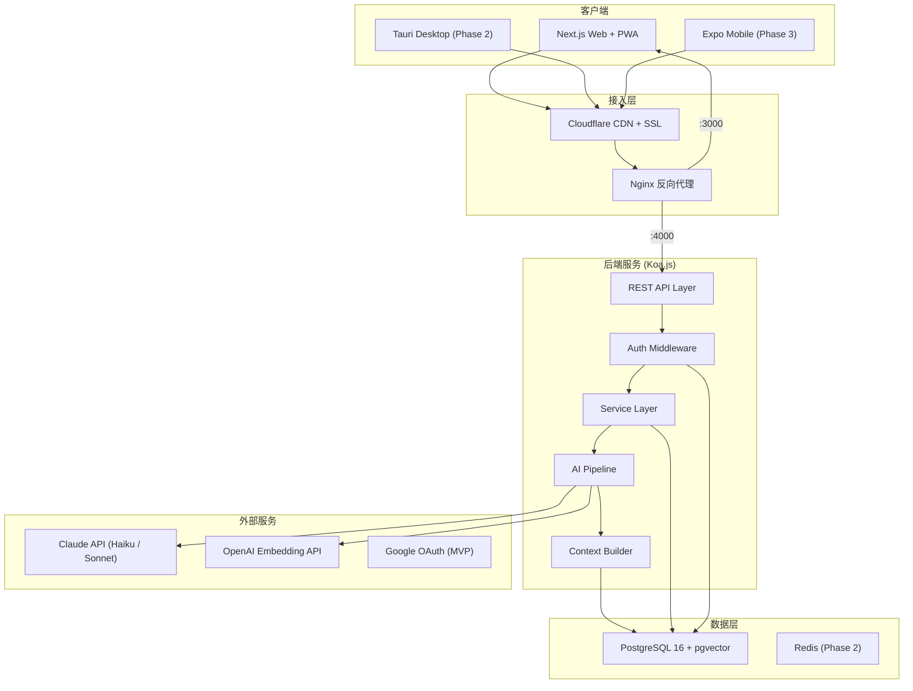
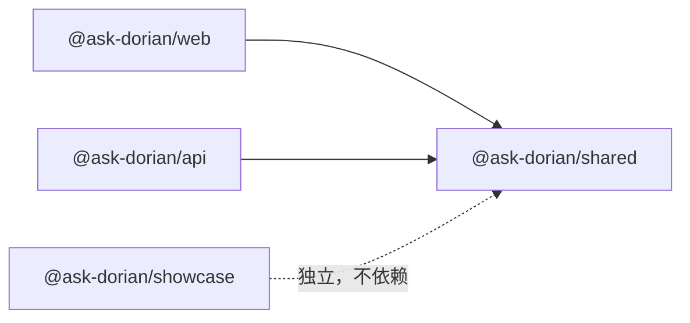
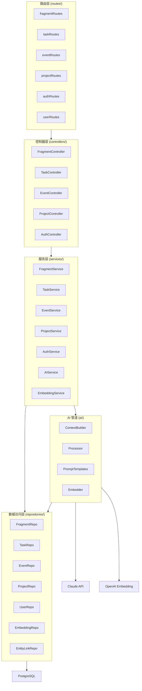
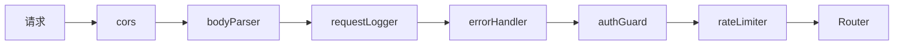
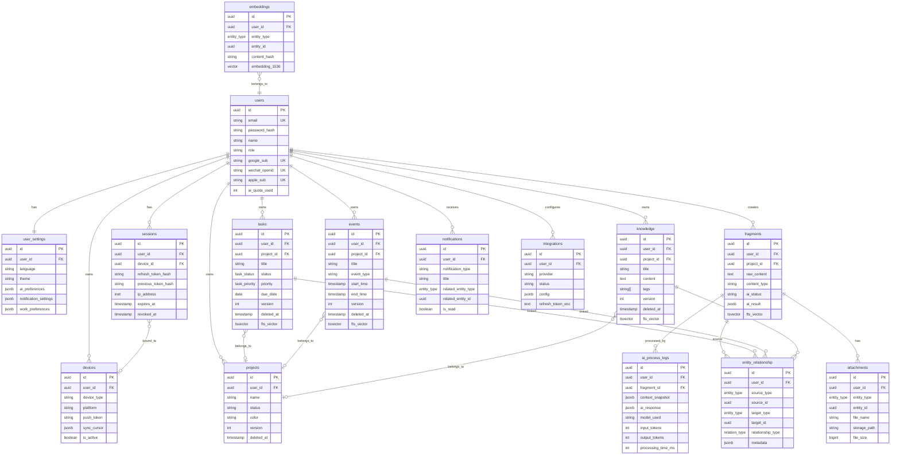
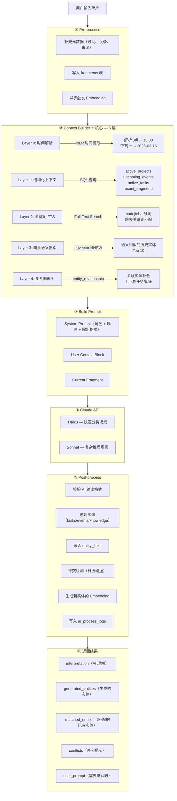
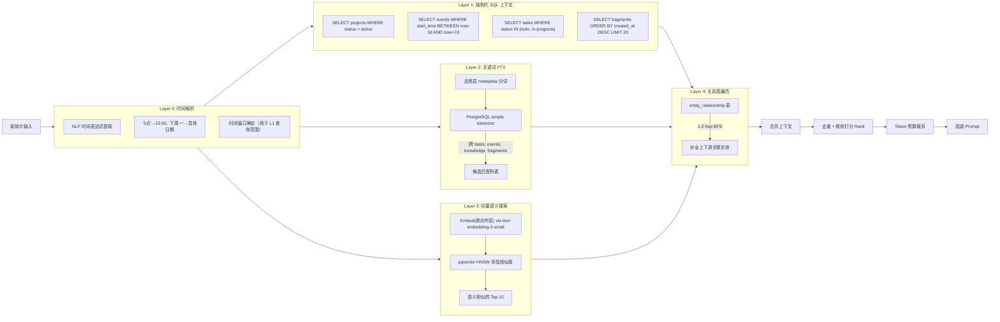
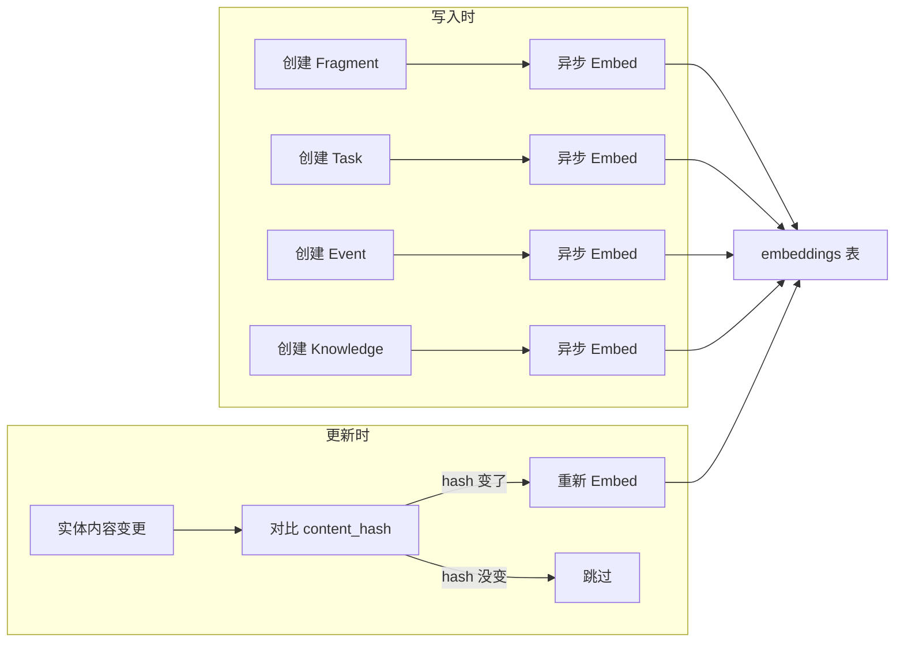
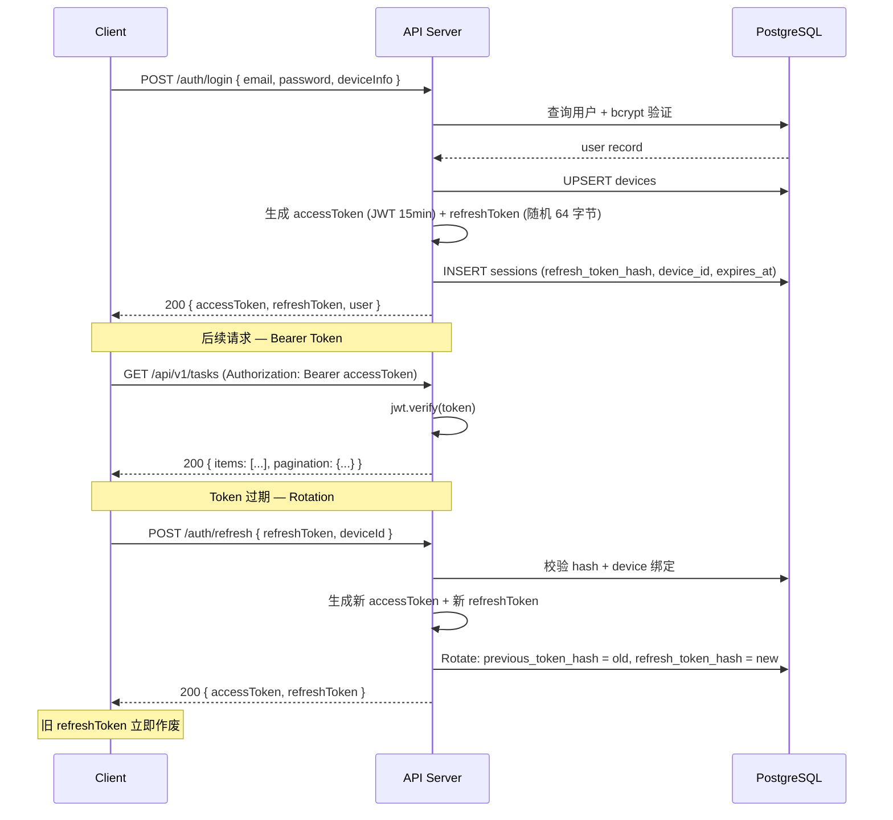
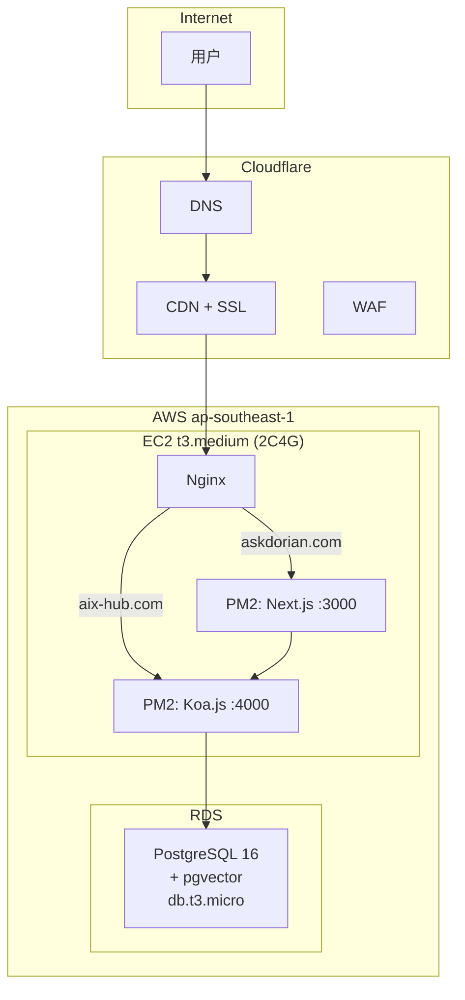

# Ask Dorian — 技术架构方案

> **定位**: 系统架构级设计文档，覆盖后端分层、数据库、AI 管道、API 设计、部署方案
> **版本**: v1.2 — 2026-03-10
> **状态**: 已确认（数据库、AI 管道、向量检索、认证、API 格式已定稿）

---

## 目录

- [一、系统架构总览](#一系统架构总览)
- [二、关键技术决策变更](#二关键技术决策变更)
- [三、Monorepo 结构](#三monorepo-结构)
- [四、后端分层架构](#四后端分层架构)
- [五、数据库设计](#五数据库设计)
- [六、AI 处理管道](#六ai-处理管道)
- [七、向量搜索方案](#七向量搜索方案)
- [八、API 设计](#八api-设计)
- [九、认证与安全](#九认证与安全)
- [十、部署架构](#十部署架构)
- [十一、技术选型汇总](#十一技术选型汇总)
- [关联文档索引](#关联文档索引)

---

## 一、系统架构总览



---

## 二、关键技术决策变更

### MySQL → PostgreSQL

| 维度 | MySQL 8.0 | PostgreSQL 16 |
|------|-----------|---------------|
| 向量搜索 | ❌ 不支持 | ✅ pgvector 原生扩展 |
| JSONB | JSON（字符串存储） | JSONB（二进制，可索引） |
| 全文搜索 | 基础 | 更强（ts_vector + 应用层中文分词） |
| Drizzle ORM | ✅ 支持 | ✅ 支持 |
| RDS 支持 | ✅ | ✅（含 pgvector） |
| 适合存 AI 上下文快照 | ⚠️ JSON 性能一般 | ✅ JSONB 高效查询 |

**结论**: 引入向量搜索后，PostgreSQL + pgvector 是唯一能用一个数据库覆盖关系型 + 向量的方案。避免多一个独立向量数据库服务。

**实际部署**: PostgreSQL 16.13 + pgvector 0.8.1 (AWS RDS db.t3.micro, ap-southeast-1)

### Embedding 模型

| 模型 | 维度 | 多语言 | 价格 | 选择 |
|------|------|--------|------|------|
| OpenAI text-embedding-3-small | 1536 | ✅ 中英文 | $0.02/1M tokens | ✅ **推荐** |
| OpenAI text-embedding-3-large | 3072 | ✅ | $0.13/1M tokens | 备选 |
| Cohere embed-multilingual-v3 | 1024 | ✅ | $0.10/1M tokens | 备选 |

选 text-embedding-3-small：便宜、快、中英文效果好、维度适中。

---

## 三、Monorepo 结构

```
ask-dorian/
├── packages/
│   ├── shared/                 # 跨端共享层（纯 TS，零框架依赖）
│   │   ├── src/
│   │   │   ├── types/          # 数据模型、API 请求/响应类型
│   │   │   ├── constants/      # 业务常量、枚举
│   │   │   ├── utils/          # 纯函数工具（日期、格式化等）
│   │   │   └── api-client/     # HTTP 封装（fetch-based，跨端通用）
│   │   ├── package.json
│   │   └── tsconfig.json
│   │
│   ├── web/                    # 正式前端（Next.js 16）
│   │   ├── src/
│   │   │   ├── app/[locale]/   # 页面路由
│   │   │   ├── components/     # UI 组件
│   │   │   ├── hooks/          # React hooks
│   │   │   ├── stores/         # 状态管理（Zustand）
│   │   │   ├── i18n/           # next-intl 配置
│   │   │   └── messages/       # zh.json, en.json
│   │   └── package.json
│   │
│   ├── api/                    # 后端（Koa.js）
│   │   ├── src/
│   │   │   ├── routes/         # 路由定义
│   │   │   ├── controllers/    # 请求处理
│   │   │   ├── services/       # 业务逻辑
│   │   │   ├── repositories/   # 数据访问
│   │   │   ├── middleware/     # auth, error, logging
│   │   │   ├── ai/            # AI 管道核心
│   │   │   │   ├── context-builder.ts
│   │   │   │   ├── prompt-templates.ts
│   │   │   │   ├── processor.ts
│   │   │   │   └── embedder.ts
│   │   │   ├── db/            # Drizzle schema + migrations
│   │   │   │   ├── schema/
│   │   │   │   └── migrations/
│   │   │   └── config/        # 环境变量、常量
│   │   └── package.json
│   │
│   └── showcase/               # UI 原型展示（现有）
│
├── docs/
│   ├── architecture/           # 技术架构文档
│   └── screenshots/
├── pnpm-workspace.yaml
├── package.json
└── .gitignore
```

### Package 依赖关系



---

## 四、后端分层架构



### 各层职责

| 层 | 职责 | 规则 |
|---|------|------|
| **Routes** | URL 映射 + 参数校验 | 只做路由注册，不含逻辑 |
| **Controllers** | 请求/响应处理 | 解析入参、调用 Service、格式化返回 |
| **Services** | 业务逻辑 | 核心逻辑在这里，可组合调用多个 Repo |
| **Repositories** | 数据访问 | Drizzle 查询封装，一个 Repo 对应一组表 |
| **AI Pipeline** | AI 处理专用 | Context 构建、Prompt 组装、结果解析、Embedding |

### Middleware 链



---

## 五、数据库设计

### ER 图



### 权威 DDL

> **完整 16 表 DDL 见**: `docs/architecture/database-schema.sql` (SSoT — Single Source of Truth)
> **多态关联设计文档**: `docs/architecture/polymorphic-association.md`

### 关键设计说明

**16 表概览**

| 表 | 用途 |
|---|------|
| users | 用户主表 |
| user_settings | 用户偏好设置（1:1） |
| devices | 跨端设备管理 + sync_cursor |
| sessions | 登录会话 + refresh token |
| projects | 项目/主题 |
| fragments | 碎片输入（不可变） |
| tasks | 任务 |
| events | 日程/事件 |
| knowledge | 知识沉淀 |
| entity_relationship | 多态关联（万能关系图） |
| embeddings | 向量存储 |
| ai_process_logs | AI 处理全量记录 |
| notifications | 通知 |
| integrations | 第三方集成 |
| attachments | 附件 |

**核心设计模式**

- **FK + 多态关联混合**: 固定 1:N 用 FK (task→project)，动态跨实体用 entity_relationship 表
- **ENUM 策略**: 极稳定值用 ENUM (task_status, entity_type)，可变值用 VARCHAR+CHECK (sync_status, event_type)
- **软删除**: 全表 `deleted_at` 列
- **乐观锁**: 全表 `version` 列（跨端冲突检测）
- **Fractional indexing**: `sort_order TEXT` 拖拽排序（Linear 风格）
- **中文 FTS**: 应用层 nodejieba 分词 → `fts_content` 列 → PostgreSQL `simple` tokenizer

**fragments 表 — 不可变**

碎片一旦写入不修改。所有处理结果在 `ai_process_logs` 和生成的实体中。`raw_content` 是用户的原始输入，`metadata` 存设备信息、位置等辅助数据。

**entity_relationship 表 — 万能关系图**

| relationship_type | 说明 | 示例 |
|-----------|------|------|
| `generated_from` | 碎片生成了实体 | fragment → task |
| `depends_on` | 依赖关系 | task → task |
| `related_to` | 相关关系 | knowledge → task |
| `split_from` | 拆分来源 | fragment → fragment |
| `recurrence_of` | 循环事件 | event → event |
| `blocks` | 阻塞关系 | task → task |

`source_type` + `source_id` + `target_type` + `target_id` 构成多态关联，一张表覆盖所有实体间关系。
详见 `docs/architecture/polymorphic-association.md`。

**embeddings 表 — 向量存储**

- `entity_type`: `'fragment'` | `'task'` | `'event'` | `'knowledge'`
- `embedding`: `vector(1536)` 类型（pgvector, OpenAI text-embedding-3-small）
- `content_hash`: 内容摘要 hash，用于检测变更决定是否需要重新 embedding
- 索引: HNSW（pgvector 支持的近似最近邻索引）

```sql
-- 创建向量索引（调优参数）
CREATE INDEX ON embeddings
  USING hnsw (embedding vector_cosine_ops)
  WITH (m = 16, ef_construction = 200);

-- 查询时设置 ef_search（推荐 100）
SET LOCAL hnsw.ef_search = 100;

-- 相似度搜索示例
SELECT entity_type, entity_id, 1 - (embedding <=> $1) AS similarity
FROM embeddings
WHERE user_id = $2
ORDER BY embedding <=> $1
LIMIT 10;
```

### ai_process_logs — AI 全量记录

每次 AI 处理都完整记录，用于：
1. **调试** — 为什么 AI 做了这个判断？
2. **优化** — 分析哪些 prompt 效果好
3. **审计** — 用户可以回溯 AI 的决策过程
4. **成本监控** — token 用量追踪

`context_snapshot` 存当次构建的完整上下文（JSONB），即使后续数据变了也能回溯当时的决策依据。

---

## 六、AI 处理管道

### 完整流程



### Context Builder 详细逻辑 — 5 层架构



### 中文全文搜索方案

AWS RDS 不支持 pg_jieba / zhparser 扩展，采用 **应用层分词** 方案：

```
用户输入 "准备季度OKR报告"
    │
    ▼ nodejieba.cut()
["准备", "季度", "OKR", "报告"]
    │
    ▼ 写入 fts_content 列
"准备 季度 OKR 报告"
    │
    ▼ PostgreSQL simple tokenizer (按空格分词)
to_tsvector('simple', fts_content)
```

所有含文本的实体表（fragments, tasks, events, knowledge）都有：
- `fts_content TEXT` — 应用层分词后的内容
- `fts_vector tsvector` — PostgreSQL GIN 索引的向量

### Rank 策略

**MVP (Phase 1)**: 规则打分 + Claude 隐式 reranker
- L1 结构化结果: 按时间/状态排序
- L2 FTS 结果: ts_rank 分数
- L3 向量结果: cosine similarity 分数
- 加权合并后作为 context 喂给 Claude，由 Claude 隐式做最终 rerank

**Phase 2**: 引入 Cohere Rerank v3 做显式 reranker

### Token 预算分配

```
System Prompt:                  ~500 tokens
User Profile:                   ~100 tokens
Time Context (L0):              ~100 tokens
Active Projects (≤5):           ~300 tokens
Upcoming Events (≤10):          ~400 tokens
Active Tasks (≤15):             ~500 tokens
Recent Fragments (≤20):         ~800 tokens
FTS Candidates (≤10):           ~400 tokens
Vector Similar Items (≤10):     ~400 tokens
Relationship Context (L4):      ~300 tokens
Current Fragment:               ~100 tokens
────────────────────────────────────────────
Total:                          ~4,000 tokens
```

Haiku context window 远大于此。如果上下文超预算，按优先级裁剪：L4 > L3 > L2 > L1 中的 recent_fragments。

---

## 七、向量搜索方案

### Embedding 时机



### 什么内容被 Embed

| 实体类型 | Embed 的内容 | 示例 |
|----------|-------------|------|
| fragment | `raw_content` | "3点 老板 增长" |
| task | `title + description` | "准备 Q2 OKR 报告 — 整理各部门目标完成度数据" |
| event | `title + description + location` | "用户增长策略讨论 — 与老板对齐 DAU 目标 — 3楼会议室" |
| knowledge | `title + content` (截取前 500 字) | "CDC 迁移方案评审纪要 — 评估了三种方案..." |

### 搜索策略

```typescript
// 1. Embed 当前碎片
const queryEmbedding = await openai.embeddings.create({
  model: 'text-embedding-3-small',
  input: fragment.rawContent,
});

// 2. pgvector 搜索
const similar = await db.execute(sql`
  SELECT entity_type, entity_id,
         1 - (embedding <=> ${queryEmbedding}) AS similarity
  FROM embeddings
  WHERE user_id = ${userId}
    AND similarity > 0.7
  ORDER BY embedding <=> ${queryEmbedding}
  LIMIT 10
`);

// 3. 加载实体详情，合并到 context
const enriched = await loadEntityDetails(similar);
```

---

## 八、API 设计

### 路由规范

- 前缀: `/api/v1/`
- 风格: RESTful
- 认证: `Authorization: Bearer <accessToken>`（除公开路由外）
- 响应格式: 裸数据模式 — 详见 `docs/architecture/api-response-format.md`

### 路由总表

```
认证（公开路由）
  POST   /api/v1/auth/register          邮箱注册
  POST   /api/v1/auth/login             邮箱登录
  POST   /api/v1/auth/google            Google OAuth 登录/注册
  POST   /api/v1/auth/refresh           刷新 Token (Rotation)

认证（需认证）
  POST   /api/v1/auth/logout            单设备登出
  POST   /api/v1/auth/logout-all        全设备登出

碎片
  POST   /api/v1/fragments              创建碎片（触发 AI 处理）
  GET    /api/v1/fragments              碎片列表（分页）
  GET    /api/v1/fragments/:id          碎片详情（含 AI 处理结果）
  POST   /api/v1/fragments/:id/confirm  确认 AI 处理结果

任务
  GET    /api/v1/tasks                  任务列表（筛选：status, project, priority, due_date）
  POST   /api/v1/tasks                  手动创建任务
  GET    /api/v1/tasks/:id              任务详情
  PATCH  /api/v1/tasks/:id              更新任务
  DELETE /api/v1/tasks/:id              软删除任务 → 204

日程
  GET    /api/v1/events                 事件列表（筛选：日期范围, type）
  POST   /api/v1/events                 创建事件
  GET    /api/v1/events/:id             事件详情
  PATCH  /api/v1/events/:id             更新事件
  DELETE /api/v1/events/:id             软删除事件 → 204

项目
  GET    /api/v1/projects               项目列表
  POST   /api/v1/projects               创建项目
  GET    /api/v1/projects/:id           项目详情（含关联 tasks/events/knowledge）
  PATCH  /api/v1/projects/:id           更新项目
  DELETE /api/v1/projects/:id           软删除项目 → 204

知识
  GET    /api/v1/knowledge              知识列表
  GET    /api/v1/knowledge/:id          知识详情
  PATCH  /api/v1/knowledge/:id          更新知识
  DELETE /api/v1/knowledge/:id          软删除知识 → 204

用户
  GET    /api/v1/user/profile           获取当前用户信息
  PATCH  /api/v1/user/profile           更新用户信息
  GET    /api/v1/user/settings          获取设置
  PATCH  /api/v1/user/settings          更新设置

今日面板
  GET    /api/v1/today                  聚合接口（today tasks + events + recent fragments + stats）
```

### 核心接口: 创建碎片

```
POST /api/v1/fragments
```

这是产品的核心 API — 用户输入碎片，触发 AI 处理管道，返回处理结果。

**Request:**
```json
{
  "rawContent": "3点 老板 增长",
  "inputSource": "cmd-k",
  "inputDevice": "desktop"
}
```

**Response:**
```json
{
  "fragment": {
    "id": "frag_xxx",
    "rawContent": "3点 老板 增长",
    "capturedAt": "2026-03-10T06:30:00Z"
  },
  "aiResult": {
    "interpretation": "推断为今天下午3点，老板召集的用户增长策略讨论会。",
    "confidence": 0.89,
    "isSplit": false,
    "matchedEntities": [
      { "type": "project", "id": "proj_xxx", "title": "数据平台" }
    ],
    "generatedEntities": [
      {
        "type": "event",
        "title": "用户增长策略讨论",
        "time": "2026-03-10T15:00",
        "project": "数据平台"
      },
      {
        "type": "task",
        "title": "准备增长数据报表",
        "priority": "high",
        "dueDate": "2026-03-10"
      }
    ],
    "conflicts": [
      {
        "description": "15:00-16:00 与已有「深度工作：性能优化」冲突",
        "suggestion": "建议将专注时间移到上午"
      }
    ],
    "userPrompt": null
  },
  "processingTimeMs": 820
}
```

---

## 九、认证与安全

> **完整认证设计**: `docs/architecture/auth-design.md`

### 核心架构 — 方案 C: 双 Token 走 JSON Body

```
Login/Register/Google OAuth
  → 服务端返回 JSON: { accessToken, refreshToken, user }
  → accessToken 存前端内存 (Zustand)
  → refreshToken 存 localStorage
  → 所有 API 请求: Authorization: Bearer <accessToken>
  → Refresh 请求: POST body { refreshToken, deviceId }
```

### Token 规格

| Token | 格式 | 有效期 | 存储 |
|-------|------|--------|------|
| Access Token | JWT HS256 `{sub, role, did}` | 15 min | 前端内存 |
| Refresh Token | 随机 64 字节 hex | 7 天 | localStorage |

### 认证流程



### 安全加固

| 策略 | 实现 |
|------|------|
| 密码 | bcrypt (cost=12)，OAuth-only 用户存 `'OAUTH_ONLY'` |
| Refresh Token Rotation | 每次 refresh 旧 token 作废，签发新 token |
| Reuse Detection | `previous_token_hash` 匹配 → 判定泄露 → revoke session |
| 设备绑定 | refreshToken 与 device_id 绑定，异设备拒绝 |
| CSRF | 不使用 Cookie → CSRF 不存在 |
| CORS | 白名单: askdorian.com |
| Rate Limit | 认证路由 5~20/窗口; 碎片创建 60/min; 通用 120/min |
| 登录锁定 | 同一 email 5 次失败 → 锁定 15 分钟 |
| Input Validation | zod schema 校验所有入参 |
| SQL Injection | Drizzle ORM 参数化查询 |
| XSS | Next.js 默认转义 + CSP + Security Headers |

### MVP 登录方式

- **邮箱 + 密码**: 标准注册/登录
- **Google OAuth**: Authorization Code Flow + PKCE
- Phase 3: 微信登录 + Apple Sign In（users 表已预留 `wechat_openid`, `apple_sub`）

---

## 十、部署架构



### 域名规划

| 域名 | 指向 | 用途 |
|------|------|------|
| `askdorian.com` | EC2:3000 | 前端 (Next.js SSR) |
| `aix-hub.com` | EC2:4000 | 后端 API (Koa.js) |

> 详见 `docs/infra.md`

---

## 十一、技术选型汇总

| 层级 | 技术 | 说明 |
|------|------|------|
| **前端** | Next.js 16 + React 19 + TypeScript | App Router, RSC |
| **样式** | Tailwind CSS 4 + shadcn/ui (base-nova) | |
| **状态管理** | Zustand | 轻量，TS 友好 |
| **i18n** | next-intl | 路由模式 /[locale]/... |
| **后端** | Koa.js + TypeScript | 独立进程 |
| **ORM** | Drizzle ORM + Drizzle Kit | Schema-first, 类型安全 |
| **数据库** | PostgreSQL 16.13 + pgvector 0.8.1 | 关系型 + 向量一体, 16 表, FK+多态混合 |
| **AI 推理** | Claude Haiku 4.5 (分类) / Sonnet 4.6 (推理) | |
| **Embedding** | OpenAI text-embedding-3-small (1536d) | |
| **认证** | JWT HS256 + Refresh Token Rotation (Bearer, 无 Cookie) | 详见 `auth-design.md` |
| **入参校验** | zod | |
| **部署** | AWS EC2 + RDS + Cloudflare + Nginx + PM2 | |
| **Monorepo** | pnpm workspace | |
| **桌面端 (P2)** | Tauri | 包 Next.js |
| **移动端 (P3)** | Expo (React Native) | 共享 @ask-dorian/shared |

---

## 关联文档索引

| 文档 | 路径 | 说明 |
|------|------|------|
| 数据库 Schema (SSoT) | `database-schema.sql` | 完整 16 表 DDL |
| 多态关联设计 | `polymorphic-association.md` | FK + 多态混合策略 |
| 认证设计方案 | `auth-design.md` | 方案 C 完整设计 |
| API 返回格式规范 | `api-response-format.md` | 裸数据 + 错误信封 |
| 基础设施与部署 | `../infra.md` | AWS + Cloudflare 部署 |
